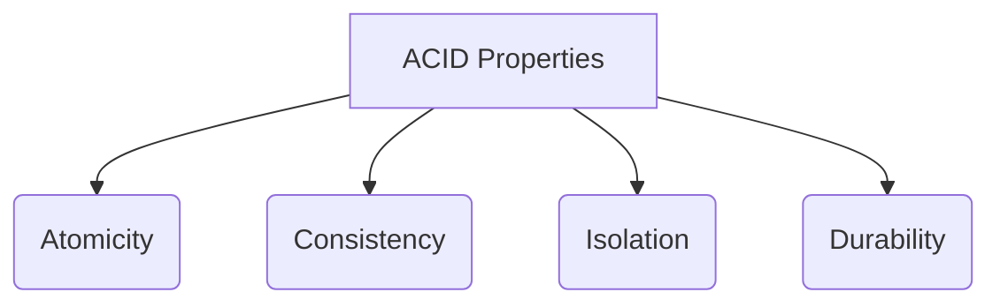

# Module 1: ACID Properties

## What is ACID?
ACID is a set of properties that guarantee database transactions are processed reliably. Every serious RDBMS (MySQL, PostgreSQL, Oracle) enforces ACID to keep your data safe and consistent.

> **ANALOGY:** Think of a bank ATM. When you transfer ₹1000 from your account to your friend's account:
> - The money must be fully deducted from yours AND fully added to theirs
> - You can't have half-a-transfer (₹1000 gone from yours, ₹0 added to theirs)
> - ACID properties ensure this never happens.

---

## A — Atomicity
**DEFINITION:** A transaction is "all or nothing." Either ALL operations in a transaction succeed, or NONE of them are applied (the database rolls back).

**ANALOGY:** Pregnancy. You're either pregnant or not — you can't be "half pregnant." A transaction either fully commits or fully aborts.

**REAL EXAMPLE:**
Online payment — 2 steps:
1. Deduct ₹500 from your account
2. Credit ₹500 to merchant's account

- *Without Atomicity:* Step 1 succeeds, server crashes before Step 2. Money is gone from your account but never reaches merchant. DISASTER.
- *With Atomicity:* Both steps are wrapped in a transaction. If Step 2 fails, Step 1 is automatically rolled back. Your ₹500 returns.

**HOW IT'S IMPLEMENTED:**
- Transaction logs / Write-Ahead Logging (WAL)
- `ROLLBACK` command undoes all changes

---

## C — Consistency
**DEFINITION:** A transaction brings the database from one valid state to another valid state. All data integrity rules, constraints, and cascades must be satisfied before and after the transaction.

**ANALOGY:** A Sudoku puzzle — you can only place numbers that don't violate the rules. Even mid-game, every move must keep the puzzle in a valid state.

**REAL EXAMPLE:**
- Rule: Account balance cannot go below ₹0.
- Transaction: Transfer ₹1000 from account with only ₹500.
- *Without Consistency:* DB allows it, balance becomes -₹500 (illegal state).
- *With Consistency:* Transaction is rejected. DB stays in valid state.

**CONSISTENCY ENFORCED BY:**
- Primary Key constraints
- Foreign Key constraints
- UNIQUE constraints
- CHECK constraints (e.g., salary > 0)
- NOT NULL constraints
- Application-level validation

---

## I — Isolation
**DEFINITION:** Concurrent transactions execute as if they were serial (one after another). Intermediate state of one transaction is invisible to others.

**ANALOGY:** Two people editing the same Google Doc simultaneously but on different sections — each sees a clean, uninterrupted editing experience (ideally). Or like two chefs cooking different dishes in the same kitchen without interfering with each other.

### Problem Without Isolation (Concurrency Anomalies):
1. **DIRTY READ:** Transaction T2 reads data modified by T1, but T1 hasn't committed yet. If T1 rolls back, T2 has read invalid "dirty" data.
2. **NON-REPEATABLE READ:** T1 reads a row, T2 updates it, T1 reads it again. T1 gets two different values for the same row in one transaction.
3. **PHANTOM READ:** T1 reads a set of rows matching a condition. T2 inserts new rows matching that condition. T1 re-reads and sees "phantom" rows.

### Isolation Levels (from least to most strict):
| Isolation Level | Dirty Read | Non-Repeatable | Phantom Read |
| --- | --- | --- | --- |
| **Read Uncommitted** | Possible | Possible | Possible |
| **Read Committed** | Prevented | Possible | Possible |
| **Repeatable Read** | Prevented | Prevented | Possible |
| **Serializable** | Prevented | Prevented | Prevented |

> Higher isolation = safer but slower (more locking).
> Most databases default to: Read Committed (PostgreSQL) or Repeatable Read (MySQL InnoDB).

---

## D — Durability
**DEFINITION:** Once a transaction is committed, it remains committed even if the system crashes (power failure, OS crash, etc.).

**ANALOGY:** Once you submit your exam paper and the teacher stamps it "received," even if the building burns down, your submission is permanently recorded (backed up elsewhere).

**HOW IT'S IMPLEMENTED:**
- Write-Ahead Logging (WAL): Changes are written to a log file on disk BEFORE being applied to the actual database
- Checkpointing: DB periodically saves state to disk
- Replication: Data is copied to multiple servers
- Backups: Regular snapshots of the entire database
