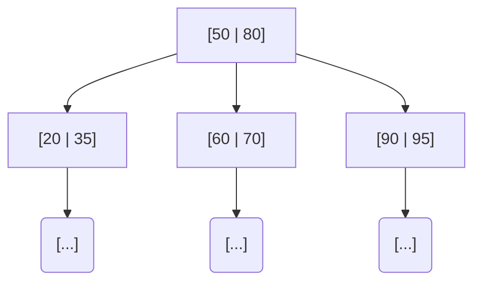
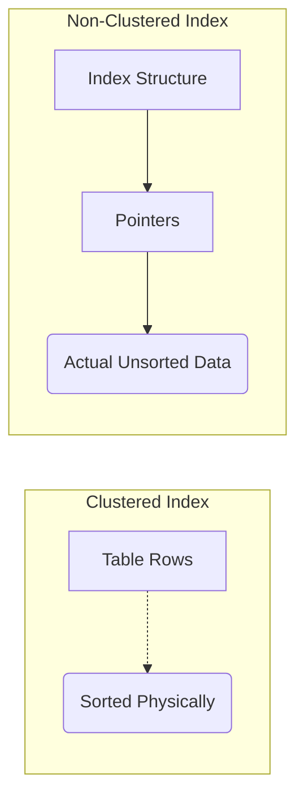

# Module 2: Indexing

## What is an Index?
An index is a data structure that improves the speed of data retrieval operations on a database table at the cost of extra storage and write speed.

> **ANALOGY:** The index at the back of a textbook. Instead of reading every page to find "TCP/IP," you go to the index, find the page number, and jump directly there. Without an index, the DB does a "full table scan" (reads every row) — like reading the entire book to find one topic.

- **WITHOUT INDEX:** `O(n)` scan — read every row
- **WITH INDEX:** `O(log n)` search — like binary search

---

## 2.1 Types of Indexes

### PRIMARY INDEX:
- Created automatically on the primary key
- Data is physically sorted by this key
- Example: Student table indexed on Roll_Number
- Only ONE primary index per table

### SECONDARY INDEX (Non-Clustering):
- Created on non-primary key columns
- Data is NOT physically sorted by this key
- Example: Index on Student.Name for fast name lookups
- Multiple secondary indexes allowed per table

### UNIQUE INDEX:
- Ensures all values in the indexed column are unique
- Example: Index on email column — no two users can have same email
- Primary key automatically creates a unique index

### COMPOSITE INDEX (Multi-Column):
- Index on two or more columns together
- Example: Index on `(last_name, first_name)`
- Useful for queries that filter on multiple columns
- **ORDER MATTERS:** Index `(A, B)` helps queries on A alone or A+B, but NOT B alone

### FULL-TEXT INDEX:
- Optimized for text search (`LIKE '%keyword%'` queries)
- Used in search engines, content platforms
- Example: Find all posts containing the word "cricket"

---

## 2.2 Index Data Structures

### B-TREE INDEX (Most Common):
- Balanced tree structure
- All leaf nodes are at same depth
- Supports: `=`, `<`, `>`, `BETWEEN`, `ORDER BY`, `LIKE 'prefix%'`
- **ANALOGY:** Library filing system — books sorted by category→author→title. You can navigate to any level efficiently.
- Time Complexity: `O(log n)` for search, insert, delete

### B+ TREE INDEX (most databases actually use this):
- Like B-tree but ALL data is stored in leaf nodes only
- Leaf nodes are linked (like a linked list)
- Internal nodes only store keys for navigation
- Great for RANGE queries (e.g., salary BETWEEN 40000 AND 80000)

### HASH INDEX:
- Uses hash function: `index_key = hash(column_value)`
- `O(1)` average for exact match queries (`=`)
- Does NOT support range queries (`<`, `>`, `BETWEEN`)
- Used in: Memory storage, hash joins
- **ANALOGY:** Locker room — key 5241 always goes to locker #41 (`hash(5241)=41`)

---

## 2.3 Clustered vs Non-Clustered Index

### CLUSTERED INDEX:
- The table data is physically sorted/stored based on this index
- Only ONE clustered index per table (data can only be physically sorted one way)
- In MySQL InnoDB: Primary Key = Clustered Index automatically
- **ANALOGY:** Library books physically arranged by Dewey Decimal number. The arrangement IS the index.
- Fast for: Range queries, ORDER BY primary key

### NON-CLUSTERED INDEX:
- Separate structure; stores pointers to actual table rows
- Multiple non-clustered indexes allowed
- **ANALOGY:** Library catalog cards — cards point to shelf location, but books aren't physically sorted by author name.
- Has an extra "lookup" step: find pointer in index, then fetch row

---

## 2.4 When to Use / Not Use Indexes

**USE INDEXES WHEN:**
- Column is frequently used in `WHERE` clauses
- Column is used in `JOIN` conditions
- Column is used in `ORDER BY` / `GROUP BY`
- Column has HIGH cardinality (many distinct values) — e.g., email, SSN

**AVOID INDEXES WHEN:**
- Table is very small (full scan is faster than index lookup)
- Column has LOW cardinality (few distinct values) — e.g., gender (M/F)
- Column is frequently updated (index must be updated too — slows writes)
- Too many indexes slow down INSERT/UPDATE/DELETE operations

> **INDEX vs NO INDEX example:**
> Table: 10 million employees. Query: `SELECT * FROM employees WHERE email = 'raj@example.com';`
> - Without Index: DB scans all 10M rows → SLOW
> - With Index on email: DB looks up B-tree, finds row directly → FAST (microseconds)
