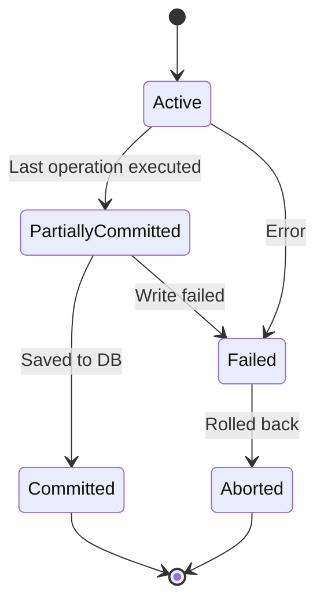

# Module 5: Transactions

## What is a Transaction?
A transaction is a sequence of one or more database operations (SELECT, INSERT, UPDATE, DELETE) that are executed as a single logical unit of work.

> **ANALOGY:** Booking a flight ticket:
> 1. Check seat availability
> 2. Reserve the seat (mark as booked)
> 3. Charge your credit card
> 4. Send confirmation email
> 
> All 4 steps = 1 transaction. If step 3 fails, steps 1 and 2 must be undone.

---

## 5.1 Transaction States



- **Active**: Transaction is executing
- **Partially Committed**: Last operation executed, but not yet written to DB
- **Committed**: All operations done, changes permanently saved
- **Failed**: Transaction cannot continue (error/violation)
- **Aborted**: All changes rolled back, DB restored to previous state

---

## 5.2 Transaction Commands (SQL)
- `BEGIN TRANSACTION` : Start a transaction
- `COMMIT` : Save all changes permanently
- `ROLLBACK` : Undo all changes since BEGIN
- `SAVEPOINT name` : Create a checkpoint within a transaction
- `ROLLBACK TO name` : Roll back only to a specific savepoint

**EXAMPLE:**
```sql
BEGIN TRANSACTION;

UPDATE Accounts SET balance = balance - 1000 WHERE AccID = 'A001';
UPDATE Accounts SET balance = balance + 1000 WHERE AccID = 'A002';

-- If both succeed:
COMMIT;

-- If any fails:
-- ROLLBACK;  (both updates are undone)
```

**SAVEPOINT EXAMPLE:**
```sql
BEGIN TRANSACTION;
INSERT INTO Orders VALUES (101, 'Laptop', 1);
SAVEPOINT after_order;
INSERT INTO Payments VALUES (101, 5000);
-- Payment fails!
ROLLBACK TO after_order;  -- Undo only payment, keep order
COMMIT;
```

---

## 5.3 Concurrency Control
**Problem:** Multiple transactions running simultaneously can cause data corruption if not properly managed.

### LOCKING MECHANISMS:

**Shared Lock (S Lock / Read Lock):**
- Multiple transactions can READ simultaneously
- No transaction can WRITE while others hold shared locks
- **ANALOGY:** Multiple people can read a book at the same time

**Exclusive Lock (X Lock / Write Lock):**
- Only ONE transaction can hold this; blocks all reads and writes
- **ANALOGY:** A bathroom — only one person inside, door locked for everyone else

### TWO-PHASE LOCKING (2PL):
1. **Phase 1 (Growing Phase):** Transaction acquires all needed locks (can only acquire, not release)
2. **Phase 2 (Shrinking Phase):** Transaction releases locks (can only release, not acquire)

*Guarantees serializability (prevents data anomalies).*

### DEADLOCK:
- T1 holds Lock A, waits for Lock B
- T2 holds Lock B, waits for Lock A
- Both wait forever → DEADLOCK
- **ANALOGY:** Two cars facing each other on a one-lane bridge — neither can move because each is waiting for the other.

**DEADLOCK PREVENTION:**
- **Wait-Die scheme:** Older transaction waits; younger one is killed (dies)
- **Wound-Wait scheme:** Older transaction wounds (aborts) the younger one
- **Timeout:** Kill transaction if it waits too long
- **Deadlock Detection:** Periodically check for cycles in wait-for graph, then abort one

---

## 5.4 Write-Ahead Logging (WAL) / Redo & Undo
**WAL:** Before making any change to the actual data, write the change to a log.
- **REDO log:** "What changes were made" (used to redo committed transactions after crash)
- **UNDO log:** "What the data was before" (used to rollback uncommitted transactions)

**RECOVERY after crash:**
- **REDO** all committed transactions (ensure durability)
- **UNDO** all uncommitted transactions (ensure atomicity)

---

## 5.5 Schedule Types
- **Serial Schedule:** Transactions execute one after another (no interleaving) → Always correct, but slow
- **Serializable Schedule:** A concurrent schedule equivalent to SOME serial schedule → Correct AND concurrent = best of both worlds

**Conflict Serializability:**
Two operations CONFLICT if:
1. They belong to different transactions AND
2. They operate on the same data item AND
3. At least one is a WRITE operation
