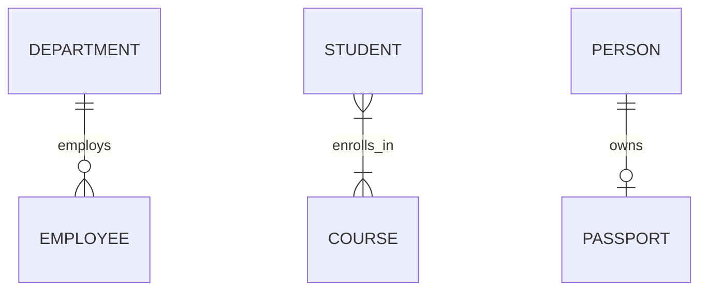

# Module 6: Additional DBMS Concepts

## 6.1 Keys in DBMS
- **Super Key**: Any combination of attributes that uniquely identifies a row
- **Candidate Key**: Minimal super key (no unnecessary attributes)
- **Primary Key**: Chosen candidate key (unique + not null)
- **Foreign Key**: References the primary key of another table
- **Composite Key**: Primary key made of multiple columns
- **Alternate Key**: Candidate keys not chosen as primary key
- **Surrogate Key**: System-generated artificial key (auto-increment ID)

---

## 6.2 ER Diagram Concepts
- **Entity**: Real-world object (Student, Employee, Product)
- **Attribute**: Property of an entity (Name, Age, Salary)
- **Relationship**: Association between entities (Student ENROLLS IN Course)

**Cardinality:**
- **1:1** (One-to-One): Person has one Passport
- **1:N** (One-to-Many): Department has many Employees
- **M:N** (Many-to-Many): Student takes many Courses; Course has many Students



---

## 6.3 Stored Procedures & Triggers
**Stored Procedure:** Pre-compiled SQL code stored in DB, called by name
- Advantage: Reusability, security, performance (compiled once)

**Trigger:** Automatic action fired when a DB event occurs
- Types: `BEFORE INSERT`, `AFTER UPDATE`, `BEFORE DELETE`, `AFTER DELETE`
- *Example:* AFTER INSERT on Orders → trigger automatically updates inventory

---

## 6.4 View
A virtual table based on a `SELECT` query. Not physically stored (usually).
- Use: Simplify complex queries, restrict column access, present data

```sql
CREATE VIEW emp_names AS 
SELECT EmpID, Name FROM Employees;
```
