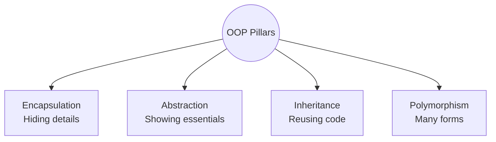

# Module 1: Fundamentals — Class, Object, Methods

## 1.1 What is OOP?
Object-Oriented Programming is a programming paradigm that organizes code around **OBJECTS (data + behavior)** rather than procedures/functions.

> **ANALOGY:** Think of real life. A car is an OBJECT. It has:
> - **Properties (data):** color, model, fuel level, speed → **ATTRIBUTES**
> - **Capabilities:** accelerate, brake, turn, honk → **METHODS**
> 
> OOP models the world exactly this way — bundling data and behavior together.

### 4 Pillars of OOP:


---

## 1.2 Class vs Object
- **CLASS:** A blueprint/template. Defines structure but doesn't hold real data.
- **OBJECT:** An instance of a class. A real "thing" created from the blueprint.

> **ANALOGY:** 
> - Class = Architect's blueprint of a house.
> - Object = The actual house built from that blueprint. 
> - Many houses (objects) can be built from the same blueprint (class).

**EXAMPLE (Python-style pseudocode):**
```python
class Car:
    def __init__(self, brand, color):
        self.brand = brand    # attribute
        self.color = color    # attribute
        self.speed = 0        # attribute

    def accelerate(self):     # method
        self.speed += 10

    def brake(self):          # method
        self.speed -= 10

# Creating objects (instances)
car1 = Car("Toyota", "Red")
car2 = Car("Honda", "Blue")
car1.accelerate()  # car1.speed = 10
car2.speed         # still 0 — different object, separate state
```

---

## 1.3 Constructor
A special method called automatically when an object is created. Used to initialize the object's attributes.

**Types (Java context):**
- **Default Constructor:** No parameters, auto-created if you write none
- **Parameterized Constructor:** Takes arguments (custom initialization)
- **Copy Constructor:** Creates a new object as a copy of an existing one

> **ANALOGY:** When a baby is born (object created), a birth certificate is automatically filled with name, date, hospital (constructor runs, sets attributes).
