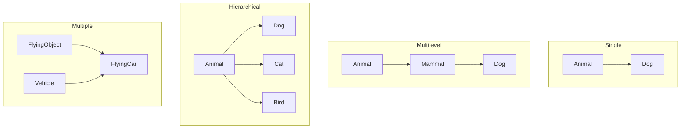

# Module 4: Inheritance

## Definition
A mechanism where a new class (child/derived/subclass) acquires the properties and behaviors of an existing class (parent/base/superclass). Promotes code reuse.

> **ANALOGY:** Biological inheritance. A child inherits traits (hair color, eye color, height tendencies) from parents. But the child also has their own unique traits.

**IS-A RELATIONSHIP:** Inheritance represents "is-a"
- Dog IS-A Animal ✓ *(Dog can inherit from Animal)*
- Car IS-A Vehicle ✓
- Car IS-A Engine ✗ *(Car HAS-A engine — use composition, not inheritance)*

---

## Types of Inheritance



1. **SINGLE INHERITANCE:** One parent, one child.
2. **MULTILEVEL INHERITANCE:** Chain of inheritance.
3. **HIERARCHICAL INHERITANCE:** One parent, multiple children.
4. **MULTIPLE INHERITANCE:** One child inherits from MULTIPLE parents.
   - *NOT supported in Java for classes* (causes Diamond Problem)
   - *Python supports it* with MRO (Method Resolution Order)
5. **HYBRID INHERITANCE:** Combination of multiple types.

---

## The Diamond Problem (Multiple Inheritance issue)
```java
class A { void hello() { print "A"; } }
class B extends A { void hello() { print "B"; } }
class C extends A { void hello() { print "C"; } }
class D extends B, C { }  // Which hello() does D inherit? B's or C's?
```
- **Java's solution:** No multiple inheritance for classes (use interfaces instead).
- **Python's solution:** MRO (Method Resolution Order) — follows C3 linearization.

---

## Inheritance Example & `super()` Keyword
```python
class Animal:
    def __init__(self, name):
        self.name = name
    def speak(self):
        return "..."
    def breathe(self):
        return f"{self.name} breathes air"

class Dog(Animal):          # Dog inherits from Animal
    def speak(self):        # overrides parent's speak
        return "Woof!"
    def fetch(self):        # Dog-specific method
        return f"{self.name} fetches the ball"

class Cat(Animal):
    def speak(self):
        return "Meow!"

dog = Dog("Buddy")
print(dog.speak())   # Woof! (overridden)
print(dog.breathe()) # Buddy breathes air (inherited from Animal)
print(dog.fetch())   # Buddy fetches the ball (Dog-specific)
```

**SUPER() KEYWORD:**
Used to call the parent class's constructor or methods.
```python
class GuideDog(Dog):
    def __init__(self, name, owner):
        super().__init__(name)  # calls Dog's __init__ (which calls Animal's)
        self.owner = owner
    def guide(self):
        return f"{self.name} guides {self.owner}"
```
