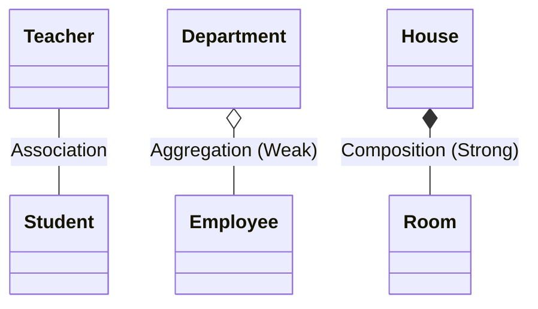

# Module 6: Additional OOP Concepts

## 6.1 Static vs Instance
- **INSTANCE members:** Belong to each object separately.
- **STATIC members:** Belong to the CLASS itself (shared across all objects).

> **ANALOGY:** Population counter — each person (object) has their own name (instance attribute), but the total population count (static variable) is shared by all and updated when anyone is born.

```python
class Student:
    total_students = 0  # static (class variable)

    def __init__(self, name):
        self.name = name              # instance variable
        Student.total_students += 1   # update shared count

s1 = Student("Raj")
s2 = Student("Priya")
print(Student.total_students)  # 2
```

---

## 6.2 Final / Const
- `final` variable: Can't be reassigned after initialization
- `final` method: Can't be overridden in subclass
- `final` class: Can't be subclassed (extended)
  
*Example:* `Math.PI` is a final variable in Java — nobody should change π! `String` class in Java is final — you can't subclass `String`.

---

## 6.3 Interfaces vs Abstract Classes

| Feature | Interface | Abstract Class |
| --- | --- | --- |
| **Instantiation** | NO | NO |
| **Methods** | Abstract (default in Java 8+) | Both abstract & concrete allowed |
| **Variables** | public static final | Any type allowed |
| **Constructor** | NO | YES |
| **Multiple Inheritance** | YES (implement many) | NO (extend one) |
| **Use when** | Defining capability ("can do") | Sharing common code with base behavior |

*REAL EXAMPLE:*
- **Abstract class:** `Vehicle` (all vehicles have wheels, engine — common behavior)
- **Interface:** `Flyable` (only some vehicles can fly — capability contract)
```java
class FlyingCar extends Vehicle implements Flyable, Drivable { ... }
```

---

## 6.4 Association, Aggregation, Composition
These represent "HAS-A" relationships between classes.

- **ASSOCIATION:** General relationship between two classes.
  - *Example:* Teacher teaches Students. Teacher can exist without Students, Students can exist without Teacher.

- **AGGREGATION (Weak HAS-A):** Whole can exist WITHOUT the part.
  - *ANALOGY:* Department has Employees. If Department is dissolved, Employees still exist (they can join other departments).
  - *Example:* `class Department { List<Employee> employees; }`

- **COMPOSITION (Strong HAS-A):** Part CANNOT exist without the whole. If the whole dies, the part dies too.
  - *ANALOGY:* Human body has a Heart. If the human dies, the heart (as part of this body) also ceases to function.
  - *Example:* `class House { Room room = new Room(); }` → When House object is destroyed, Room is also destroyed.



---

## 6.5 SOLID Principles (Design Principles)

- **S — Single Responsibility Principle:** A class should have only ONE reason to change. Each class does ONE thing.
  - *BAD:* UserService handles login + send email + update DB (3 responsibilities)
  - *GOOD:* AuthService (login), EmailService (send), UserRepository (DB)

- **O — Open/Closed Principle:** Open for EXTENSION, Closed for MODIFICATION. Add new features by adding new code, not changing existing code.
  - *BAD:* Add new payment type by editing existing PaymentProcessor
  - *GOOD:* Add new PaymentMethod class that implements PaymentInterface

- **L — Liskov Substitution Principle:** Subclass objects should be replaceable for parent objects without breaking the program.
  - *BAD:* Penguin extends Bird — Bird has `fly()`, Penguin can't fly!
  - *GOOD:* Restructure: FlyingBird extends Bird; Penguin extends Bird (no fly)

- **I — Interface Segregation Principle:** Don't force clients to implement methods they don't need.
  - *BAD:* One fat Interface with 20 methods
  - *GOOD:* Multiple small, focused interfaces (Printable, Scannable, Faxable)

- **D — Dependency Inversion Principle:** High-level modules should not depend on low-level modules. Both should depend on ABSTRACTIONS (interfaces).
  - *BAD:* EmailService directly creates and uses SmtpMailer
  - *GOOD:* EmailService depends on IMailer interface; SmtpMailer implements IMailer

---

## 6.6 Design Patterns (Brief Overview)
- **CREATIONAL PATTERNS** (how objects are created):
  - *Singleton:* Only ONE instance of a class (e.g., DB connection pool, logger)
  - *Factory:* Let subclasses decide which class to instantiate
  - *Builder:* Construct complex objects step by step
- **STRUCTURAL PATTERNS** (how classes are composed):
  - *Decorator:* Add behavior to objects without subclassing (like wrapping gifts)
  - *Adapter:* Make incompatible interfaces work together (like a power adapter)
- **BEHAVIORAL PATTERNS** (how objects communicate):
  - *Observer:* Notify multiple objects of state changes (pub/sub, event listeners)
  - *Strategy:* Define family of algorithms, make them interchangeable
  - *Iterator:* Traverse elements without exposing internal structure

---

## 6.7 Key OOP Interview Questions — Quick Answers

**Q: What is the difference between abstract class and interface?**
**A:** Abstract class can have concrete methods and state; interface defines a pure contract. Use abstract class for "is-a" with shared behavior, interface for capability/"can-do".

**Q: Can we override a private method?**
**A:** No. Private methods are not visible to subclasses, so there's nothing to override.

**Q: What is the difference between method overloading and overriding?**
**A:** Overloading = same class, same name, different parameters (compile-time). Overriding = parent-child, same signature, different implementation (runtime).

**Q: Can we override a static method?**
**A:** No. Static methods belong to the class, not the object. You can hide them (method hiding), but it's not true polymorphic overriding.

**Q: What is a constructor chaining?**
**A:** Calling one constructor from another using `this()` (same class) or `super()` (parent).

**Q: What is the difference between `==` and `equals()`?**
**A:** `==` compares references (same memory location). `equals()` compares content/value (can be overridden). `"Hello" == "Hello"` may be true (string pool), but `new String("Hello") == new String("Hello")` is false.
