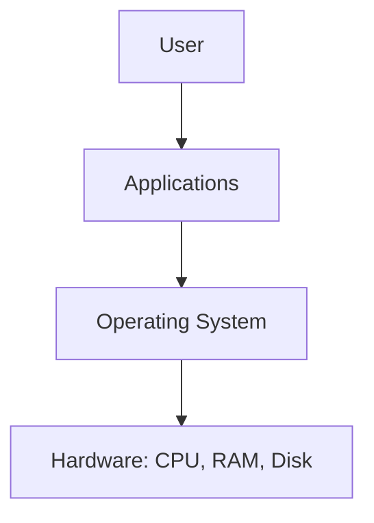

# Module 1: Introduction to Operating Systems

## 1.1 What is an Operating System?
An OS is system software that acts as an intermediary between the user/applications and the computer hardware. It manages hardware resources and provides services for application programs.

> **ANALOGY:** Think of the OS as a hotel manager:
> - **Hotel rooms** = CPU, RAM, disk (hardware resources)
> - **Guests** = programs/applications
> - **Hotel manager (OS)** = allocates rooms, handles requests, ensures no guest disturbs another, manages checkout (resource deallocation)

### FUNCTIONS OF AN OS:
- **Process Management:** Create, schedule, terminate processes
- **Memory Management:** Allocate/deallocate RAM
- **File System Management:** Organize files on disk
- **Device Management:** Manage I/O devices via drivers
- **Security & Protection:** User authentication, access control
- **UI:** CLI or GUI interface

### TYPES OF OS:
- **Batch OS:** Processes jobs in batches without user interaction
- **Time-Sharing OS:** Multiple users share CPU in time slices (Unix)
- **Real-Time OS:** Strict timing deadlines (embedded systems, aircraft)
- **Distributed OS:** Multiple machines appear as one system
- **Network OS:** Manages network resources (Windows Server)
- **Mobile OS:** Android, iOS
