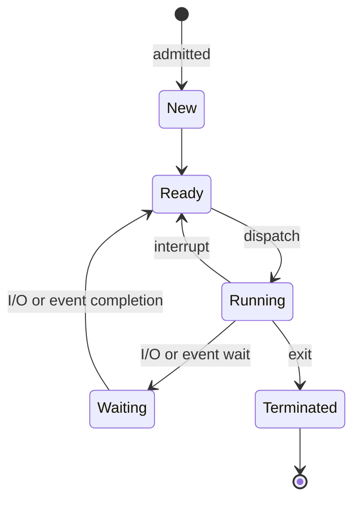

# Module 2: Processes and Threads

## 2.1 Process
A process is a **PROGRAM in execution**. When you double-click Chrome, the program (static code on disk) becomes a process (dynamic entity in memory).

> **ANALOGY:** A recipe (program) vs. cooking the recipe (process). The same recipe can be cooked multiple times simultaneously in different kitchens — same program, different processes.

### PROCESS COMPONENTS (Address Space):
- **Code Segment:** Program instructions
- **Data Segment:** Global/static variables
- **Heap:** Dynamically allocated memory (malloc, new)
- **Stack:** Function calls, local variables, return addresses

### PCB (PROCESS CONTROL BLOCK):
The OS maintains a PCB for every process. It's like a "file" about the process. Contains: Process ID (PID), State, Program Counter, CPU Registers, Memory info, I/O status, Scheduling info, Parent PID.

### PROCESS STATES:

- **New:** Process just created
- **Ready:** Waiting for CPU (in ready queue)
- **Running:** Currently executing on CPU
- **Waiting:** Waiting for I/O or event (not using CPU)
- **Terminated:** Process has finished execution

---

## 2.2 Process vs Thread
- **PROCESS:** Independent program with its own address space.
- **THREAD:** Lightweight unit within a process that shares the process's address space.

> **ANALOGY:** A restaurant:
> - **Process** = The entire restaurant (has its own kitchen, tables, staff)
> - **Thread** = Individual waiters within that restaurant (share the kitchen, tables, resources, but each waiter works on their own tasks)

| Feature | Process | Thread |
| --- | --- | --- |
| **Memory** | Separate (isolated) | Shared within process |
| **Creation cost** | Expensive (heavy) | Cheap (lightweight) |
| **Communication** | IPC (complex) | Direct (easy) |
| **Context switch** | Expensive | Cheaper |
| **Crash impact** | Other processes unaffected | Crashes entire process |

### Thread Types:
- **User-Level Threads:** Managed by user-space library (fast, OS unaware)
- **Kernel-Level Threads:** Managed by OS (slower, true parallelism on multicore)

---

## 2.3 Context Switching
When the CPU switches from one process/thread to another:
1. Save state of current process (PC, registers, etc.) to its PCB
2. Load state of next process from its PCB
3. Resume execution of next process

> **ANALOGY:** Like pausing a video game, saving the save-file (PCB), picking up a different game (new process), and loading its save-file.
> *Context switching is OVERHEAD — pure CPU time wasted on bookkeeping.*
