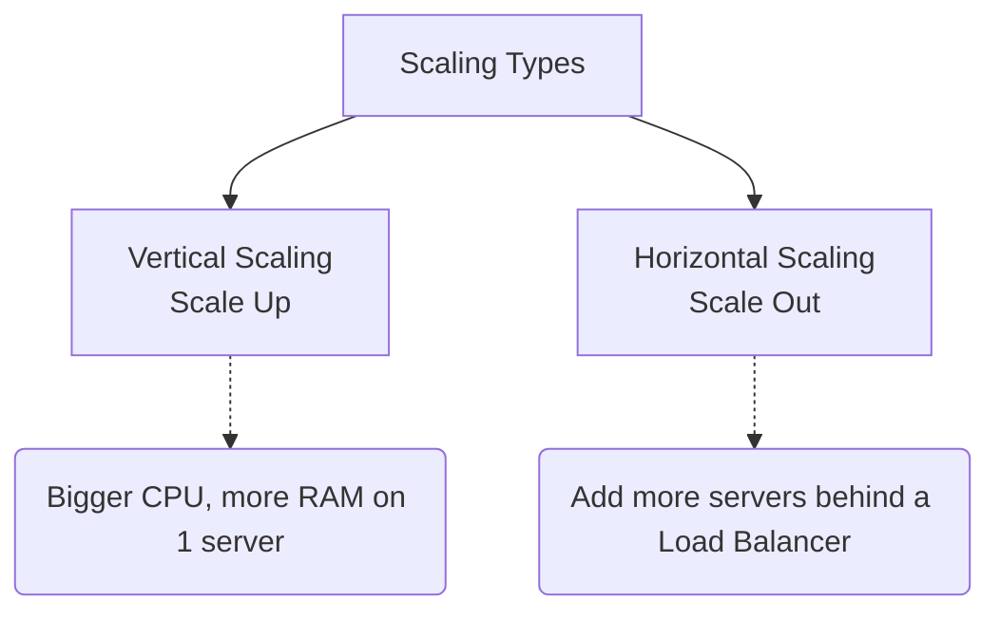

# Module 1: Fundamentals and Key Concepts

## 1.1 Why System Design?
System Design is the process of defining the architecture, components, modules, interfaces, and data flow of a system to satisfy specified requirements.

> **ANALOGY:** Building a city. You don't just build houses randomly — you plan:
> - Roads (network infrastructure)
> - Water supply (databases)
> - Electricity grid (servers/compute)
> - Hospitals (fault-tolerance/redundancy)
> - Population capacity (scalability)
> - Emergency services (monitoring/alerting)

## 1.2 Key Design Goals
- **SCALABILITY:** Handle increasing load (more users, more data)
- **RELIABILITY:** System works correctly even when components fail
- **AVAILABILITY:** System is up and accessible (uptime %)
- **PERFORMANCE:** Fast response times, high throughput
- **MAINTAINABILITY:** Easy to update, debug, extend
- **COST-EFFICIENCY:** Optimal resource usage

---

## 1.3 Scalability Types

### VERTICAL SCALING (Scale Up):
- Add more power to the SAME machine (more CPU, more RAM)
- *ANALOGY:* Upgrading one cook's kitchen with better equipment
- **Pros:** Simple, no code changes needed
- **Cons:** Physical limits, single point of failure, expensive
- *Example:* Upgrade from 8-core to 64-core server

### HORIZONTAL SCALING (Scale Out):
- Add MORE machines to the pool
- *ANALOGY:* Hiring more cooks instead of upgrading one kitchen
- **Pros:** Theoretically infinite, fault-tolerant
- **Cons:** Distributed system complexity, need load balancer
- *Example:* Add 10 more web servers behind a load balancer

---

## 1.4 CAP Theorem (Brewer's Theorem)
In a **DISTRIBUTED** system, you can only guarantee 2 out of 3:

- **C — CONSISTENCY:** Every read receives the most recent write
- **A — AVAILABILITY:** Every request receives a response (not necessarily latest data)
- **P — PARTITION TOLERANCE:** System works even if network partitions occur

> **ANALOGY:** Three friends maintaining a shared notebook (distributed system):
> If the network between them breaks (partition), they face a choice: Either keep everyone's copy in sync (Consistency) OR ensure everyone can still read/write (Availability). Not both.

In practice, **Partition Tolerance is a MUST** for distributed systems (network failures WILL happen). So the real choice is:

- **CP (Consistent + Partition Tolerant):** Refuses to respond if it can't guarantee consistency. (HBase, ZooKeeper). Use for Banking.
- **AP (Available + Partition Tolerant):** Will respond with possibly stale data. (Cassandra, DynamoDB). Use for Social Media feeds.

---

## 1.5 Consistency Models
- **STRONG CONSISTENCY:** After a write, all reads return the new value immediately. (Slowest — must synchronize all nodes before returning)
- **EVENTUAL CONSISTENCY:** After a write, reads will EVENTUALLY return the new value (might return stale data temporarily).
  - *ANALOGY: DNS updates — after you update a DNS record, it takes time to propagate worldwide.*
- **CAUSAL CONSISTENCY:** Operations that are causally related are seen in order by all nodes. (If A causes B, everyone sees A before B)
