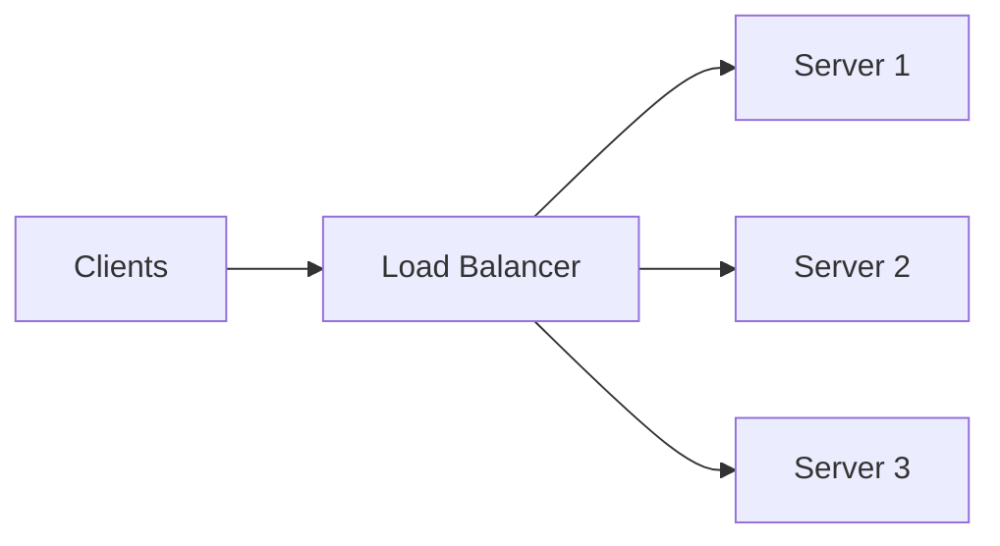

# Module 2: Load Balancing

## 2.1 What is a Load Balancer?
A load balancer distributes incoming network requests across multiple servers to ensure no single server becomes a bottleneck.

> **ANALOGY:** A traffic policeman at a busy intersection distributing cars across multiple lanes. If one lane is blocked, the policeman redirects to other lanes. Or a bank with multiple tellers — the "next customer" sign directs the next person to whichever teller is available.

**BENEFITS:**
- Distributes load evenly
- Improves availability (if one server dies, traffic goes to others)
- Enables horizontal scaling
- Provides SSL termination (decrypt once at LB, forward unencrypted to servers)

---

## 2.2 Load Balancing Algorithms

- **ROUND ROBIN:** Requests distributed in circular order (S1 → S2 → S3 → S1 → S2...). Simple, but doesn't account for server load differences. *(ANALOGY: Dealing cards in a card game)*
- **WEIGHTED ROUND ROBIN:** Servers with higher capacity get more requests. Useful when servers have different capabilities.
- **LEAST CONNECTIONS:** Route to server with fewest active connections. Better when requests have varying processing times. *(ANALOGY: Grocery checkout — pick queue with fewest people)*
- **IP HASH:** Hash of client's IP determines which server. Same client ALWAYS goes to same server (session affinity/sticky sessions). Useful for stateful applications.
- **RANDOM:** Random server selection. Simple, works well with many servers.

---

## 2.3 Layer 4 vs Layer 7 Load Balancing
- **Layer 4 LB (Transport Layer):** Routes based on IP + TCP/UDP port. Faster (doesn't inspect content). *Example: AWS Network Load Balancer.*
- **Layer 7 LB (Application Layer):** Routes based on HTTP headers, URL paths, cookies. Smarter routing: `/images/` → image servers, `/api/` → API servers. *Example: AWS Application Load Balancer, Nginx.*

---

## 2.4 Single Point of Failure
What if the load balancer itself fails? → Add a second load balancer!
Use Active-Passive or Active-Active setup with health checks. DNS-level redundancy (multiple LB IPs in DNS).
